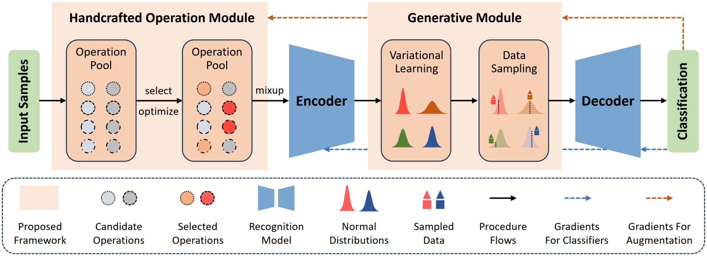
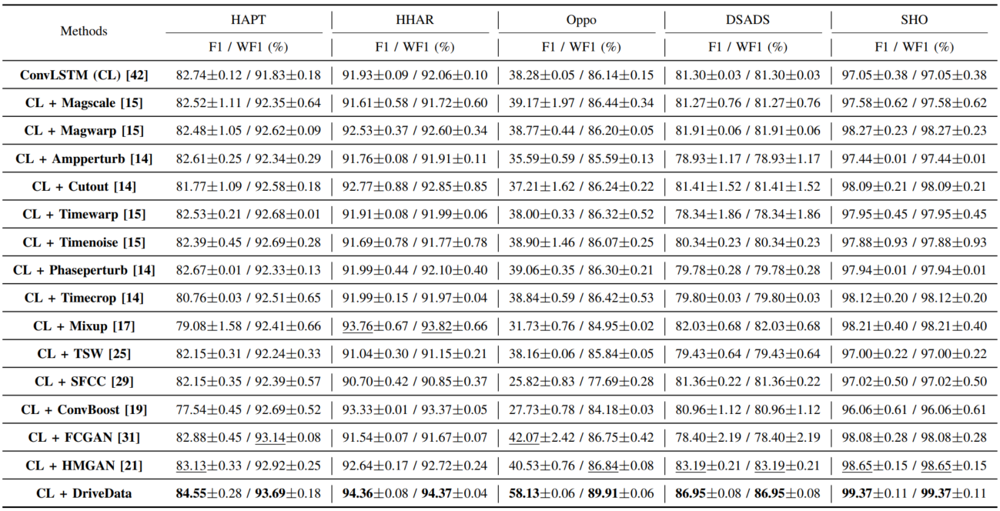
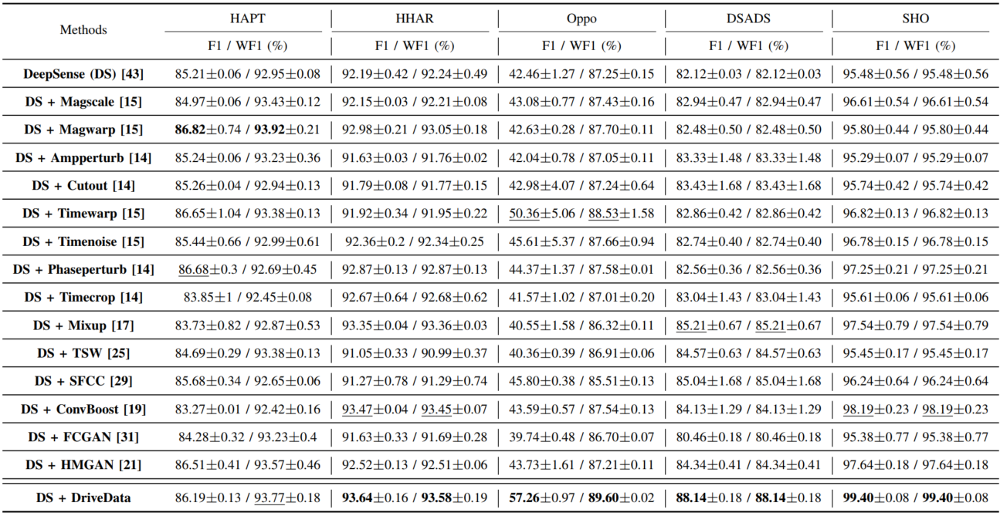
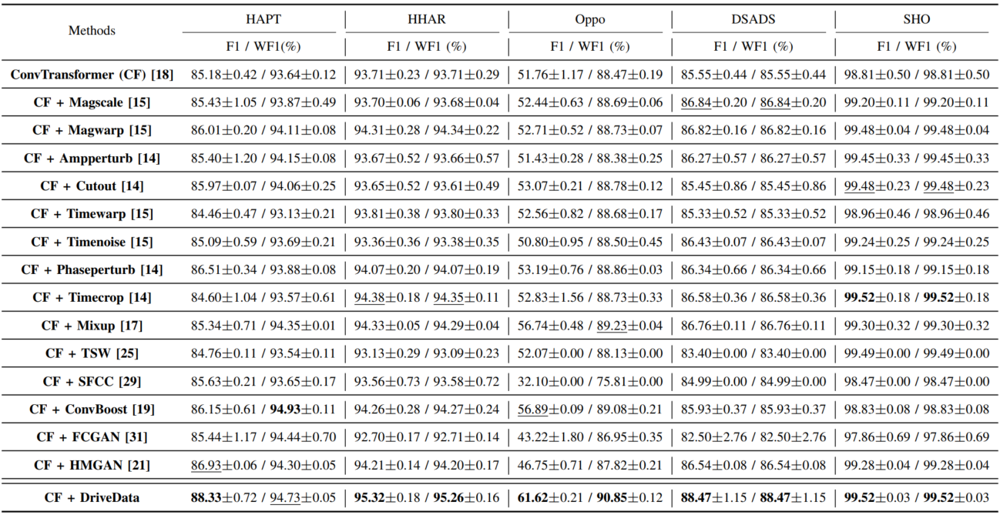

# Differentiable Prior-driven Data Augmentation for Sensor-based Human Activity Recognition
This is the pytorch implementation of our paper 'Differentiable Prior-driven Data Augmentation for Sensor-based Human Activity Recognition'.



## Algorithm Introduction:

In this work, a differentiable prior-driven data augmentation framework for sensor-based human activity recognition is proposed. Extensive experimental results with three different classifiers on five public datasets demonstrate the effectiveness of the proposed framework. The contributions of this work are summarized as follows:

- We propose a **D**ifferentiable P**ri**or-dri**ve**n **Da**ta Augmen**ta**tion (DriveData) framework for sensor-based HAR, which is composed of a handcrafted operation module and a generative module.
- We design a handcrafted operation module, including the candidate operation pool, the reparameterization trick, and the gradient estimator, to adaptively select and optimize the augmentation operations.
- We construct a generative module using variational learning mechanism to add controllable perturbations to the samples derived by the handcrafted operations, and further improves the diversity of data augmentation.
- The proposed DriveData framework obtains superior performance on three baseline HAR models over five benchmark datasets.

## Preparation:

**1. Dependencies:**

- Training and testing are performed on a PC with Ubuntu 22.04 system, 2 x NVIDIA 3090 GPU.
- Python=3.8.16, cuda=11.3.1, PyTorch=1.12.1, scikit-learn=1.2.2.

**2. Data Loading and Preprocessing:**

- The datasets used in this paper can be easily downloaded according to the links provided by corresponding articles. These links are also provided in the top parts of our data loading codes.
- Note that, to facilitate data loading, some datasets are transformed to '.npy' or '.csv' formats. Please run the format transformation code before data loading and preprocessing. 
- **Demo for data format transformation:** Run 'src/utils/load_Opportunity_dataset/save_Oppotunity_Dataset_as_csv_files/Save_Oppo_dataset_as_csv.py'. It can be observed that, a 'clean_opp.csv' file is generated in the 'dataset/Opportunity' folder.
- The code for data loading and preprocessing of each dataset are provided in the 'utils' folder.

## Train:

To train a model on specific dataset, you should issue the following command: 

```
Run the 'src/main.py'. Select datasets, classifiers or augmentation mode in 'src/constants.py'. Set '--PATTERN' of 'src/constants.py' as 'TRAIN'.
```

Or:

```
python main.py --PATTERN TRAIN --DATASETS (choose datasets, e.g. HAPT, Opportunity) --CLASSIFIERS (choose classifers, e.g. Deep_Conv_LSTM_torch, DeepSense_torch, Deep_Conv_Transformer_torch) --AUGMENT_MTHODS_LIST (choose angmentation methods, e.g. ['DriveData'], ['Mixup'])
```

Note that, the hyperparameters of classifiers on different datasets are put into the 'src/utils/hyperparams.yaml' file.

## Test:

To test a model after training, you should issue the following command: 

```
Run the 'src/main.py'. Select datasets or classifiers in 'src/constants.py'. Set '--PATTERN' of 'src/constants.py' as 'TEST'.
```

Or:

```
python main.py --PATTERN TEST --DATASETS (choose datasets, e.g. HAPT, Opportunity) --CLASSIFIERS (choose classifers, e.g. Deep_Conv_LSTM_torch, DeepSense_torch, Deep_Conv_Transformer_torch)
```

**Demo for testing:**

Since we have uploaded the 'Deep_Conv_Transformer_torch' models trained on 'HAPT' dataset, you can directly run testing by:

```
python main.py --PATTERN TEST --DATASETS HAPT --CLASSIFIERS Deep_Conv_Transformer_torch
```

## Results: 







## Contact:

**Welcome to raise issues or email to zhangy2658@mail.sysu.edu.cn or yundazhangye@163.com for any question regarding this work.**